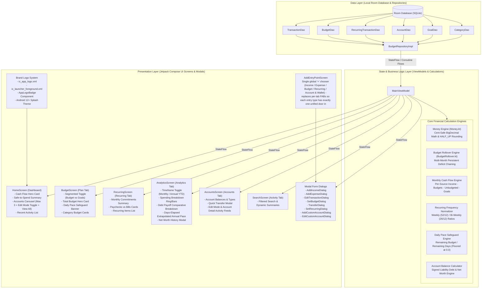

# Architecture & Financial Calculation Reference (ADR)

## Executive Summary

**Self-Budget App** is a local-first, privacy-focused Android financial application built using modern Android development standards: **Kotlin Multiplatform / Android Jetpack Compose**, **MVVM (Model-View-ViewModel)** pattern, **Room Database**, **Hilt Dependency Injection**, and **Kotlin Coroutines / StateFlow**.

This document serves as the authoritative Architecture Decision Record (ADR) and System Blueprint. It details the system layer hierarchy, financial calculation engines, frequency normalizations, deduplication safeguards, brand vector integration, layout scroll architecture, and exact field-by-field UI mapping.

---

## 1. System Architecture Diagram



---

## 2. Core Financial Calculation Engines

### 2.1 Cent-Safe Precision Engine ([`Money.kt`](file:///Users/bbhanda1/Desktop/Personal%20Projects/self-budget-app/app/src/main/java/com/selfbudget/app/core/util/Money.kt))

To prevent floating-point accumulation drift (e.g. `19.99 * 3` accumulating fractions of cents like `59.970000000000006`), all monetary operations pass through [`Money.kt`](file:///Users/bbhanda1/Desktop/Personal%20Projects/self-budget-app/app/src/main/java/com/selfbudget/app/core/util/Money.kt).

*   **Rounding Rule**: Standard half-up rounding using `BigDecimal.valueOf(amount).setScale(2, RoundingMode.HALF_UP)`.
*   **Cent Storage & Conversion Guard**: Converting `Double` to integer cents (`Long`) explicitly invokes `.setScale(0, RoundingMode.HALF_UP)` prior to `.toLong()`, preventing binary floating-point residual truncation.

$$\text{Cent-Safe Sum}(A_1, A_2, \dots, A_n) = \frac{\sum_{i=1}^n \text{toCents}(A_i)}{100.0}$$

---

### 2.2 Recurring Frequency Normalization Engine ([`RecurringFrequencyNormalizer.kt`](file:///Users/bbhanda1/Desktop/Personal%20Projects/self-budget-app/app/src/main/java/com/selfbudget/app/core/util/RecurringFrequencyNormalizer.kt))

Bills and income occur at different frequencies (Weekly, Bi-Weekly, Monthly, Yearly). All recurring items are normalized to their exact monthly equivalent figure using runtime fractional ratios:

$$\text{Monthly Equivalent} = \begin{cases} 
\text{Amount} \times \frac{52.0}{12.0} & \text{if Frequency = WEEKLY} \\
\text{Amount} \times \frac{26.0}{12.0} & \text{if Frequency = BI\_WEEKLY} \\
\text{Amount} \times 1.0 & \text{if Frequency = MONTHLY} \\
\frac{\text{Amount}}{12.0} & \text{if Frequency = YEARLY}
\end{cases}$$

Every normalized amount is rounded via `Money.round(raw)` (e.g. $500/week normalizes to exactly $2,166.67/mo).

> [!NOTE]
> **Single Source of Truth**: `MainViewModel.syncBudgetForRecurringExpense` (the budget-ceiling auto-sync, see §2.7) and [`SetBudgetDialog.kt`](file:///Users/bbhanda1/Desktop/Personal%20Projects/self-budget-app/app/src/main/java/com/selfbudget/app/feature/budget/SetBudgetDialog.kt)'s suggested-limit preview both call this same engine. They previously duplicated the math with a truncated `× 4.333` / `× 2.166` approximation instead of the exact `52/12` / `26/12` ratios, which meant the number shown while setting a budget could silently disagree with the number the ceiling actually synced to.

---

### 2.3 Monthly Cash Flow & Free Cash Engine ([`HomeScreen.kt`](file:///Users/bbhanda1/Desktop/Personal%20Projects/self-budget-app/app/src/main/java/com/selfbudget/app/feature/dashboard/HomeScreen.kt), [`IncomeCalculator.kt`](file:///Users/bbhanda1/Desktop/Personal%20Projects/self-budget-app/app/src/main/java/com/selfbudget/app/core/util/IncomeCalculator.kt))

The Cash Flow Engine evaluates unassigned "Free Cash" remaining after accounting for planned commitments, category budgets, and savings goals.

#### 1. Per-Source Effective Monthly Income ([`IncomeCalculator.kt`](file:///Users/bbhanda1/Desktop/Personal%20Projects/self-budget-app/app/src/main/java/com/selfbudget/app/core/util/IncomeCalculator.kt)):
Effective income is computed per income source $s$, preventing ad-hoc freelance income from being silently dropped when expected salary alone exceeds logged income:

$$\text{Effective Income} = \sum_{s \in \text{Recurring Sources}} \max\left(\text{Logged}_s, \, \text{Expected}_s\right) + \sum \text{Ad-Hoc / Freelance Logged Income}$$

#### 2. Category Budget Commitments (Unified Source of Truth):
Both the Dashboard and the Plan tab use the **effective budget limit** (rollover-adjusted). For budgeted categories, commitment is calculated as $\max(\text{EffectiveLimit}_c, \, \text{RecurringBill}_c)$:

$$\text{Category Budgets Commitment} = \sum_{c \in \text{Budgeted Categories}} \max\left(\text{EffectiveLimit}_c, \, \text{RecurringBill}_c\right)$$

#### 3. Unbudgeted Fixed Bills & Expenses:
For categories without an explicit monthly budget limit, commitment is calculated as the maximum of recurring bills or actual logged spent:

$$\text{Unbudgeted Commitment}_c = \max\left(\text{Recurring Bills}_c, \, \text{Actual Spent}_c\right) \quad \forall c \notin \text{Budgeted Categories}$$

$$\text{Total Unbudgeted Commitments} = \sum_{c \notin \text{Budgeted Categories}} \text{Unbudgeted Commitment}_c$$

#### 4. Monthly Goal Savings Commitments (Data Flow Decision):
Money set aside for active Savings Goals is tracked as planned savings commitments, preventing earmarked goal savings from showing up as "Free" cash flow:

$$\text{Goal Savings Commitment}_g = \begin{cases} \frac{\text{Target Amount}_g - \text{Saved Amount}_g}{\text{Months Remaining to Target Date}} & \text{if Target Date is set in future} \\ 0.0 & \text{otherwise} \end{cases}$$

#### 5. Total Committed Allocated & Unallocated Free Cash:
$$\text{Total Committed Allocated} = \text{Category Budgets Commitment} + \text{Total Unbudgeted Commitments} + \sum \text{Goal Savings Commitments}$$

$$\text{Unallocated Free Cash} = \text{Effective Income} - \text{Total Committed Allocated}$$

*   **Positive Result**: Displayed as **`$X.XX Free`** in green.
*   **Negative Result**: Displayed as **`$X.XX Over Budget`** in red.
*   **No Income Logged**: Displayed as **`$X.XX Allocated`** in primary blue.

---

### 2.4 Category Budget & Rollover Engine ([`BudgetRollover.kt`](file:///Users/bbhanda1/Desktop/Personal%20Projects/self-budget-app/app/src/main/java/com/selfbudget/app/core/util/BudgetRollover.kt))

#### 1. Multi-Month Persistent Deficit Carryover Chaining:
When rollover is enabled, carryover chains off the previous month's **unclamped net position** so overspending deficits persist across consecutive months until fully repaid, rather than evaporating after one clamped month:

$$\text{UnclampedPosition}_m = \text{BaseLimit}_m + (\text{UnclampedPosition}_{m-1} - \text{Spent}_{m-1})$$

$$\text{EffectiveLimit}_m = \max\left(0.0, \, \text{UnclampedPosition}_m\right)$$

#### 2. Safe to Spend per Category & UX Note:
$$\text{Pending Upcoming Bill} = \max\left(0, \, \text{Recurring Monthly Bill} - \text{Actual Spent}\right)$$

$$\text{Safe to Spend} = \max\left(0, \, \text{Effective Limit} - \text{Actual Spent} - \text{Pending Upcoming Bill}\right)$$

> [!NOTE]
> **UX Edge Case Behavior Note**: When `Actual Spent < Recurring Bill`, `Safe to Spend = Effective Limit - Recurring Bill`, which remains constant regardless of discretionary spending in the category until the recurring bill posts.

#### 3. Daily Pace Safeguard (Zero-Floored):
$$\text{Daily Pace Max} = \max\left(0.0, \, \frac{\text{Remaining Budget}}{\text{Remaining Days in Month}}\right)$$

---

### 2.5 Net Worth & Account Balance Engine ([`AccountBalanceCalculator.kt`](file:///Users/bbhanda1/Desktop/Personal%20Projects/self-budget-app/app/src/main/java/com/selfbudget/app/core/util/AccountBalanceCalculator.kt))

#### 1. Signed Balance Convention & Liability Accounts:
- **Asset Accounts**: Income increases balance (+), Expenses decrease balance (-).
- **Display Layer Formatting (Monarch/Mint Convention)**: In presentation components ([`HomeScreen.kt`](file:///Users/bbhanda1/Desktop/Personal%20Projects/self-budget-app/app/src/main/java/com/selfbudget/app/feature/dashboard/HomeScreen.kt), [`AccountsScreen.kt`](file:///Users/bbhanda1/Desktop/Personal%20Projects/self-budget-app/app/src/main/java/com/selfbudget/app/feature/accounts/AccountsScreen.kt), [`AccountsViewAllModal.kt`](file:///Users/bbhanda1/Desktop/Personal%20Projects/self-budget-app/app/src/main/java/com/selfbudget/app/core/ui/AccountsViewAllModal.kt), [`AccountSelectionModal.kt`](file:///Users/bbhanda1/Desktop/Personal%20Projects/self-budget-app/app/src/main/java/com/selfbudget/app/core/ui/AccountSelectionModal.kt)), credit card and loan debt balances are displayed as positive unsigned values (e.g. `$150.00`) under their labeled liability categories, matching standard consumer finance expectations while maintaining negative values in backend Net Worth equations. Purchases charged on credit card decrease balance (-tx.amount, making debt more negative). Payments targeting credit card/loan debt increase balance (+tx.amount, reducing debt toward $0).

#### 2. Net Worth Calculation:
$$\text{Net Worth} = \sum_{a \in \text{Accounts}} \text{Account Balance}_a$$

---

### 2.6 Extrapolated Annual Spending Pace ([`AnalyticsScreen.kt`](file:///Users/bbhanda1/Desktop/Personal%20Projects/self-budget-app/app/src/main/java/com/selfbudget/app/feature/analytics/AnalyticsScreen.kt))

To avoid noisy figures early in a month, Annual Spending Pace is extrapolated based on total calendar days elapsed year-to-date:

$$\text{Annual Spending Pace} = \text{Money.round}\left(\frac{\text{YTD Expense Spend}}{\text{Day of Year}} \times \text{Days in Year}\right)$$

---

### 2.7 Automated Google Drive Cloud Sync Engine ([`GoogleDriveSyncManager.kt`](file:///Users/bbhanda1/Desktop/Personal%20Projects/self-budget-app/app/src/main/java/com/selfbudget/app/core/util/GoogleDriveSyncManager.kt))

- **Zero Cost to Developer**: Operates directly using the user's personal Google Account and Google Drive storage quota ($0.00 infrastructure cost).
- **Private Sandbox Scope (`DriveScopes.DRIVE_APPDATA`)**: Backups are written to the user's hidden Google Drive `appDataFolder` (`self_budget_cloud_backup.json`), keeping financial data isolated from standard user Drive files and third-party apps.
- **On-Demand & Background Restore**: Supports background uploads (`uploadToAppDataFolder`) and cloud restoration (`downloadFromAppDataFolder`) seamlessly across multiple Android devices.

---

### 2.7 Single Entry Point & Category Budget Auto-Sync Engine ([`MainViewModel.kt`](file:///Users/bbhanda1/Desktop/Personal%20Projects/self-budget-app/app/src/main/java/com/selfbudget/app/ui/MainViewModel.kt))

Two UI surfaces can create or edit a recurring bill — the transaction form's "recurring" toggle and the Recurring tab's own form. Both now route through one private function, `MainViewModel.upsertRecurring`, which is the only code path allowed to create/update a `RecurringTransactionEntity` and trigger the category's budget-ceiling sync. This guarantees the two surfaces can never disagree about what counts as a duplicate bill (matched by `(userId, categoryId, title, frequency)`, per §6) or how the resulting budget suggestion is computed.

`syncBudgetForRecurringExpense` recomputes the suggested ceiling from the current recurring bill every time it runs — it does not only ever raise the limit — but only when the budget's `isAutoSynced` flag is `true`:

$$\text{SuggestedLimit} = \lceil \text{RecurringFrequencyNormalizer.toMonthlyAmount}(\text{amount}, \text{frequency}) \rceil$$

$$\text{Budget}'_{\text{amountLimit}} = \begin{cases} \text{SuggestedLimit} & \text{if no budget exists yet, or } \text{isAutoSynced} = \text{true} \\ \text{Budget.amountLimit (unchanged)} & \text{if isAutoSynced} = \text{false (manually set)} \end{cases}$$

Setting a category's limit by hand on the budget screen (`MainViewModel.setCategoryBudget`) sets `isAutoSynced = false`, so a hand-picked number is never silently overwritten by a later recurring-bill edit. Deleting that budget clears the override, letting auto-sync suggest a fresh ceiling the next time a recurring bill in that category changes.

---

## 3. Brand Identity & Vector Resource Architecture

The official app logo is built from [`selfbudget_app_logo.svg`](file:///Users/bbhanda1/Desktop/Personal%20Projects/self-budget-app/selfbudget_app_logo.svg) (Dark Teal badge, Mint/Gold/White ascending savings bars, and on-track checkmark coin accent).

*   **High-Resolution Vector Asset**: [`ic_app_logo.xml`](file:///Users/bbhanda1/Desktop/Personal%20Projects/self-budget-app/app/src/main/res/drawable/ic_app_logo.xml) (512x512 viewport).
*   **Android Adaptive Launcher Icon**: [`ic_launcher_foreground.xml`](file:///Users/bbhanda1/Desktop/Personal%20Projects/self-budget-app/app/src/main/res/drawable/ic_launcher_foreground.xml) scaled to 108x108 with 72dp safe zone padding on [`ic_launcher_background.xml`](file:///Users/bbhanda1/Desktop/Personal%20Projects/self-budget-app/app/src/main/res/drawable/ic_launcher_background.xml).
*   **Android 12+ Cold Start Splash Screen**: Configured in [`themes.xml`](file:///Users/bbhanda1/Desktop/Personal%20Projects/self-budget-app/app/src/main/res/values/themes.xml) via `android:windowSplashScreenAnimatedIcon` set to `@drawable/ic_app_logo` on background `#123A33`.
*   **Compose Brand Component**: [`AppLogoBadge`](file:///Users/bbhanda1/Desktop/Personal%20Projects/self-budget-app/app/src/main/java/com/selfbudget/app/core/ui/AppLogo.kt) rendering the vector drawable in Jetpack Compose UI headers and lock screens.

---

## 4. Scroll Architecture & Layout Standards

All primary tabs ([`HomeScreen.kt`](file:///Users/bbhanda1/Desktop/Personal%20Projects/self-budget-app/app/src/main/java/com/selfbudget/app/feature/dashboard/HomeScreen.kt), [`BudgetScreen.kt`](file:///Users/bbhanda1/Desktop/Personal%20Projects/self-budget-app/app/src/main/java/com/selfbudget/app/feature/budget/BudgetScreen.kt), [`RecurringScreen.kt`](file:///Users/bbhanda1/Desktop/Personal%20Projects/self-budget-app/app/src/main/java/com/selfbudget/app/feature/recurring/RecurringScreen.kt), [`AnalyticsScreen.kt`](file:///Users/bbhanda1/Desktop/Personal%20Projects/self-budget-app/app/src/main/java/com/selfbudget/app/feature/analytics/AnalyticsScreen.kt), [`AccountsScreen.kt`](file:///Users/bbhanda1/Desktop/Personal%20Projects/self-budget-app/app/src/main/java/com/selfbudget/app/feature/accounts/AccountsScreen.kt), [`SearchScreen.kt`](file:///Users/bbhanda1/Desktop/Personal%20Projects/self-budget-app/app/src/main/java/com/selfbudget/app/feature/search/SearchScreen.kt)) enforce a unified layout hierarchy:

```kotlin
Box(modifier = Modifier.fillMaxSize()) {
    Column(
        modifier = Modifier
            .fillMaxSize()
            .verticalScroll(rememberScrollState())
            .padding(horizontal = 16.dp, vertical = 8.dp)
    ) {
        // Hero Cards, View Toggles, Filter Chips, List Items via .forEach
        
        Spacer(modifier = Modifier.height(150.dp))
    }

    FloatingActionButton(modifier = Modifier.align(Alignment.BottomEnd))
}
```

### 2.8 Persistent Forward-Inheriting Monthly Budgeting ([`BudgetCalculator.kt`](file:///Users/bbhanda1/Desktop/Personal%20Projects/self-budget-app/app/src/main/java/com/selfbudget/app/core/util/BudgetCalculator.kt))

#### 1. Forward Baseline Inheritance (Monarch/Mint Model):
When a category budget is set for month $M$, it establishes an active recurring monthly baseline. For any target month $T$, the effective budget is resolved by finding the most recent budget set on or before $T$:

$$\text{EffectiveBudget}(c, T) = \text{Latest}\left(\{ b \in \text{Budgets}(c) \mid b.\text{monthYear} \le T \land b.\text{amountLimit} > 0 \}\right)$$

#### 2. Historical Immutability & Future Isolation:
- **Past Months ($P < M$)**: Editing a budget in month $M$ creates a record at $M$. Any past month $P$ queries records where $\text{monthYear} \le P$, ensuring past analytics, spending reports, and historical cash flow are **100% immutable**.
- **Future Months ($F > M$)**: Future months automatically inherit month $M$'s new baseline without requiring manual monthly recreation.
- **Deletions & Ceilings**: Deleting a category budget in month $M$ stores a record with $\text{amountLimit} = 0.0$ at month $M$. Future months recognize this as no budget, while months prior to $M$ retain their historical limits.

---

## 5. Comprehensive UI Field Population Matrix

| Screen / Component | UI Field / Label | Underlying Calculation / Formula | Source Data / Entities |
| :--- | :--- | :--- | :--- |
| **Top Navigation Bar** | **App Brand Header** | `AppLogoBadge(size = 28.dp)` + `Text("Self Budget")` | [`AppLogo.kt`](file:///Users/bbhanda1/Desktop/Personal%20Projects/self-budget-app/app/src/main/java/com/selfbudget/app/core/ui/AppLogo.kt), [`ic_app_logo.xml`](file:///Users/bbhanda1/Desktop/Personal%20Projects/self-budget-app/app/src/main/res/drawable/ic_app_logo.xml) |
| **Splash Screen** | **Cold Start Logo** | Theme `@drawable/ic_app_logo` on `#123A33` | [`themes.xml`](file:///Users/bbhanda1/Desktop/Personal%20Projects/self-budget-app/app/src/main/res/values/themes.xml) |
| **Dashboard** (`HomeScreen.kt`) | **Cash Flow Headline** | `if (!hasIncome) "$X Allocated" else if (Free >= 0) "$X Free" else "$X Over Budget"` | `IncomeCalculator.computeEffectiveMonthlyIncome` - `TotalCommittedAllocated` |
| **Dashboard** (`HomeScreen.kt`) | **Income Column** | `if (Logged < Effective) "$X (Est.)" else "$X"` | `IncomeCalculator.computeEffectiveMonthlyIncome` |
| **Dashboard** (`HomeScreen.kt`) | **Budgets Column** | $\sum \max(\text{EffectiveLimit}_c, \, \text{RecurringBill}_c)$ for active category budgets | `BudgetRollover.effectiveLimit`, `RecurringFrequencyNormalizer` |
| **Dashboard** (`HomeScreen.kt`) | **Unbudgeted Column** | $\sum \max(\text{RecurringBill}, \text{ActualSpent})$ for non-budgeted categories | `RecurringFrequencyNormalizer`, `TransactionEntity` |
| **Dashboard** (`HomeScreen.kt`) | **Paid Column** | `Money.sum(ExpenseTransactions)` for month | `TransactionEntity (EXPENSE)` |
| **Plan Tab** (`BudgetScreen.kt`) | **Total Monthly Budget** | `Money.sum(CategoryEffectiveLimits)` | `BudgetRollover.effectiveLimit` |
| **Plan Tab** (`BudgetScreen.kt`) | **Daily Pace Banner** | $\max\left(0.0, \, \frac{\text{Remaining Budget}}{\text{Remaining Days}}\right)$ | `(TotalBudget - TotalSpent) / RemainingDays` |
| **Plan Tab** (`BudgetScreen.kt`) | **Safe to Spend Pill** | $\max(0, \text{EffectiveLimit} - \text{Spent} - \text{PendingRecurring})$ | `CategoryBudgetUiModel.safeToSpendAmount` |
| **Recurring** (`RecurringScreen.kt`) | **Paychecks Card** | `Money.sum(NormalizedIncomeList)` | `RecurringFrequencyNormalizer` |
| **Recurring** (`RecurringScreen.kt`) | **Bills & Subs Card** | `Money.sum(NormalizedExpenseList)` | `RecurringFrequencyNormalizer` |
| **Analytics** (`AnalyticsScreen.kt`) | **Annual Spending Pace** | $\text{Money.round}\left(\frac{\text{YTD Expense Spend}}{\text{Day of Year}} \times \text{Days in Year}\right)$ | `TransactionEntity` year-to-date sum & `Calendar` |
| **Analytics** (`AnalyticsScreen.kt`) | **Debt Payoff MoM Comparison** | $\text{diffAmount} = \text{TotalDebtPayoff}_m - \text{TotalDebtPayoff}_{m-1}$; $\text{diffPercent} = (\text{diffAmount} / \text{prevTotal}) \times 100$ | `TransactionEntity` targeting liability accounts |
| **Savings Goals** (`GoalsSection.kt`) | **Goal Progress Bar** | `if (target > 0) (current / target).toFloat() else 0f` | `GoalEntity`, `AccountBalanceCalculator` |
| **Accounts** (`AccountsSection.kt`, `AccountsViewAllModal.kt`) | **Edit Mode vs Activity View** | `if (isEditMode) openEditAccountDialog else openAccountDetailActivityView` | `AccountEntity`, `TransactionEntity` by `accountId` |

---

## 6. Deduplication & Data Integrity Safeguards

1.  **Category Budget Deduplication (`F-96`)**: Unique Room index on `(userId, categoryId, monthYear)`.
2.  **Recurring Transaction Deduplication (`F-97`, `F-103`)**: Matched by `(userId, categoryId, title, frequency)` inside `MainViewModel.upsertRecurring` — the single entry point both the transaction form's recurring toggle and the Recurring tab's own form call into, so the same duplicate check applies no matter which surface created the bill.
3.  **Cent-Safe Conversion Guard (`F-98`)**: `Money.kt` applies `.setScale(0, HALF_UP)` prior to `.toLong()`.
4.  **Goal Divide-by-Zero Guard**: Progress guarded against `targetAmount <= 0.0`.
5.  **150.dp Scroll Clearance (`F-99`, `F-100`, `F-116`)**: End of all main scroll containers includes `Spacer(modifier = Modifier.height(150.dp))`, and View Details modal sheets include `120.dp`–`150.dp` scroll clearance.
6.  **Manual Budget Override Protection (`F-103`)**: `BudgetEntity.isAutoSynced` prevents the recurring-bill budget-ceiling sync from overwriting a category limit the user set by hand (see §2.7).
7.  **Destructive Action Isolation (`F-112`)**: Clean Sweep / Reset All App Data is isolated inside the dedicated `Data & Account Management` page in Settings, protected by a dual-step glowing red trash badge Material 3 confirmation dialog.

---

## 7. Verification & Compliance

*   **Automated Unit Tests**: 84+ unit tests passing 100% under `app/src/test/java/com/selfbudget/app/`.
*   **Test Execution Command**: `./gradlew test`
